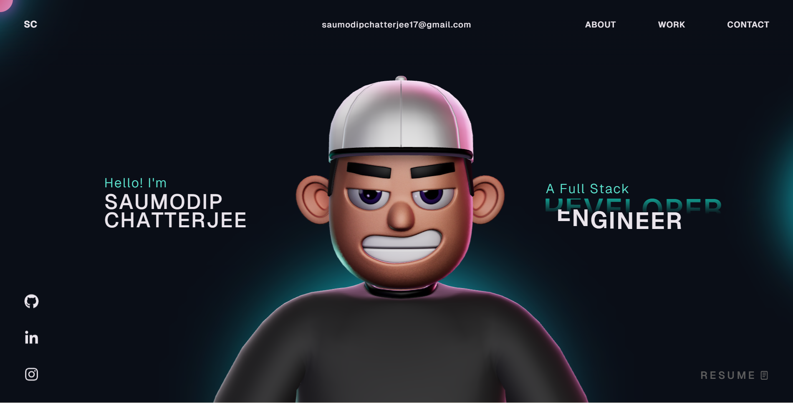

# Saumodip Chatterjee - Personal Portfolio Website 🚀

Welcome to the open-source repository of my personal portfolio website!

## About My Portfolio 🛠️

This website is designed to showcase my skills, educational background, experience, and the projects I have worked on as a developer.

**Tech Stack Used:** 
- React
- TypeScript
- GSAP (GreenSock Animation Platform)
- ThreeJS & WebGL
- HTML, CSS, JavaScript

## Preview 📸

## License

This project is open-source and available under the [MIT License](LICENSE).
